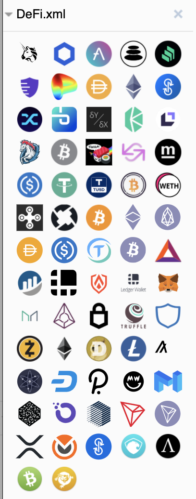

# DlAGRAMS

A collection of icons to be used in Draw.io (http://app.diagrams.net) containing:

- Popular Cryptocurrencies Icons
- Wallets & Applications
- Decentralized Finance (DeFi)

## Usage

- Use in the Browser: [draw.io](https://app.diagrams.net/?splash=0&clibs=Uhttps%3A%2F%2Fshayanb.github.io%2Fdlagrams%2FDeFi.xml)

- Import in your Browser Instance: Go to *file* --> *Open Library From* --> *URL*, and paste this address `https://shayanb.github.io/dlagrams/DeFi.xml`

- On native apps, Clone this repo, and then import {Library_name.xml} (e.g. `defi.xml`) by going to *file* --> *Open Library*

Still need help? [Work with custom shape libraries](https://desk.draw.io/support/solutions/articles/16000067790-work-with-custom-shape-libraries)

## Screenshot

